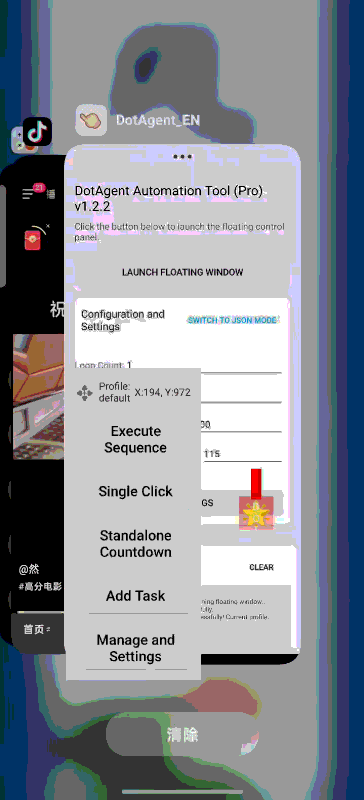

// ========== FILE: README.md ==========

[简体中文](#-点点特工-dot-agent---v122) | [English](#-dot-agent---v122)

---

#  点点特工 (Dot Agent) - v1.2.2

一款功能强大的安卓自动化脚本工具，专为需要精细化、可定制自动化流程的用户设计。通过可视化操作和强大的配置系统，让您轻松创建、管理和执行复杂的自动化任务。

---

### 演示

*()*

---

### ✨ 功能特性

* **- 可视化操作**：提供悬浮的“控制面板”和“目标视图”，所有操作直观可见。
* **- 任务序列**：支持创建包含**点击**、**滑动**和**等待**的复杂任务序列。
* **- 循环执行**：可设置任务序列的循环次数，轻松实现重复性工作。
* **- 方案管理系统**：
    * 可以保存和加载多套独立的配置方案（包含设置和任务列表）。
    * 支持创建新方案、另存为、删除等操作。
    * 另存为新方案后可自动加载，无需手动切换。
* **- 主题与颜色定制**：允许用户自定义悬浮窗元素的颜色，打造个性化界面。
* **- 新手引导**：首次使用时提供分步引导，帮助用户快速上手。
* **- 导入/导出**：方便地备份您的方案或与他人分享。（权限问题，未能测试好）
* **- 高级编辑模式**：内置 JSON 编辑器，供高级用户直接修改和查看配置数据。

---

### ⚙️ 运行环境

* 安卓 (Android) 5.0 及以上版本。
* [AutoJs6 ](https://github.com/SuperMonster003/AutoJs6) 6.6.4 或类似兼容的应用环境。

---

### 🚀 如何使用

1.  **下载脚本**：下载本项目中的 `DotAgent.js` 文件到您的手机。
2.  **导入应用**：打开 autojs6 应用，将 `DotAgent.js` 文件导入到脚本列表中（打包或者下载apk安装到手机）。
3.  **授予权限**：
    * 首次运行前，请务必在手机的“设置”中为 autojs6 应用开启**无障碍服务**权限。
    * 脚本启动时会请求**悬浮窗**权限，请允许。
    * 如果需要使用导入/导出功能，请授予**存储**权限。
4.  **运行脚本**：在 autojs6 中点击运行 `DotAgent.js`，主界面将会出现。
5.  **开始使用**：点击主界面的“启动悬浮窗口”按钮，即可开始创建您的自动化流程。

---

### 📖 未来计划 (Roadmap)

我们计划在未来的版本中加入更强大的功能，欢迎您参与贡献！

-   [ ] **图像识别**：实现基于图片的查找与点击，摆脱坐标依赖。
-   [ ] **任务复制**：在管理界面快速复制已有的任务。
-   [ ] **任务分组**：支持将任务折叠分组，方便管理长序列任务。
-   [ ] **一键备份/恢复**：实现所有方案的一键打包备份与恢复。

---

### 🤝 如何贡献

欢迎任何形式的贡献！无论是报告问题、提出建议还是提交代码。请参考我们的 [CONTRIBUTING.md](CONTRIBUTING.md) 文件了解详情。

---

### 📄 开源许可

本项目采用 MIT 许可证。详情请见 [LICENSE](LICENSE) 文件。

---
 

# Dot Agent - v1.2.2

A powerful Android automation scripting tool designed for users who need fine-grained, customizable automation workflows. Create, manage, and execute complex automation tasks with ease through its visual interface and robust configuration system.

---

### Demo

*(It is highly recommended to record a short GIF or video demonstrating the script's floating window operations, task adding, and execution process, and then replace the placeholder below.)*

---

### ✨ Features

* **- Visual Operation**: Provides a floating "Control Panel" and "Target View," making all operations intuitive.
* **- Task Sequence**: Supports creating complex task sequences including **clicks**, **swipes**, and **waits**.
* **- Loop Execution**: Set the loop count for task sequences to easily accomplish repetitive work.
* **- Profile Management System**:
    * Supports saving and loading multiple independent sets of configuration schemes (including settings and task lists).
    * Supports creating new profiles, saving as, and deleting operations.
    * Automatically loads a new profile after saving as, no manual switching required.
* **- Theme & Color Customization**: Allows users to customize the colors of floating window elements to create a personalized interface.
* **- New User Tutorial**: Provides a step-by-step guide on first use to help new users get started quickly.
* **- Import/Export**: Conveniently back up your profiles or share them with others.
* **- Advanced Editing Mode**: A built-in JSON editor for advanced users to directly modify and view configuration data.

---

### ⚙️ Prerequisites

* Android 5.0 or later.
* [AutoJs6 ](https://github.com/SuperMonster003/AutoJs6) 6.6.4 or a similar compatible application environment.

---

### 🚀 How to Use

1.  **Download the Script**: Download the `DotAgent.js` file from this project to your phone.
2.  **Import into Application**: Open the autojs6 application and import the script file into the script list.
3.  **Grant Permissions**:
    * Before the first run, be sure to enable **Accessibility Service** permissions for the autojs6 application in your phone's "Settings".
    * The script will request **Floating Window** permissions on launch; please allow it.
    * If you need to use the import/export feature, please grant **Storage** permissions.
4.  **Run the Script**: Run the script in autojs6, and the main interface will appear.
5.  **Start Using**: Click the "Launch Floating Window" button on the main interface to start creating your automation workflows.

---

### 📖 Roadmap

We plan to add more powerful features in future versions and welcome your contributions!

-   [ ] **Image Recognition**: Implement image-based finding and clicking to eliminate dependency on coordinates.
-   [ ] **Task Duplication**: Quickly duplicate existing tasks in the management interface.
-   [ ] **Task Grouping**: Support grouping and collapsing tasks for easier management of long sequences.
-   [ ] **One-Click Backup/Restore**: Implement one-click package backup and restoration of all profiles.

---

### 🤝 How to Contribute

Contributions of any kind are welcome! Whether it's reporting issues, making suggestions, or submitting code. Please refer to our [CONTRIBUTING.md](CONTRIBUTING.md) file for more details.

---

### 📄 License

This project is licensed under the MIT License. See the [LICENSE](LICENSE) file for details.

// ========== END OF FILE: README.md ==========

